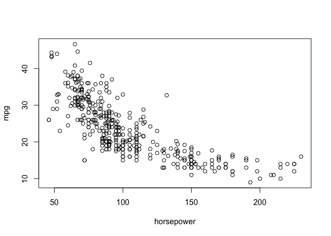

In this notebook, I am performing Statistical learning based on the book
of Introduction to Statistical learning.

Linear regression - least squares
---------------------------------

for prediction and estimates for quantitave variables

    library(MASS)
    library(ISLR)
    data(Boston)
    names(Boston)

    ##  [1] "crim"    "zn"      "indus"   "chas"    "nox"     "rm"      "age"    
    ##  [8] "dis"     "rad"     "tax"     "ptratio" "black"   "lstat"   "medv"

Simple linear regression model to predict medv by lstat

    lm.fit = lm(medv~lstat, data = Boston)
    summary(lm.fit)

    ## 
    ## Call:
    ## lm(formula = medv ~ lstat, data = Boston)
    ## 
    ## Residuals:
    ##     Min      1Q  Median      3Q     Max 
    ## -15.168  -3.990  -1.318   2.034  24.500 
    ## 
    ## Coefficients:
    ##             Estimate Std. Error t value Pr(>|t|)    
    ## (Intercept) 34.55384    0.56263   61.41   <2e-16 ***
    ## lstat       -0.95005    0.03873  -24.53   <2e-16 ***
    ## ---
    ## Signif. codes:  0 '***' 0.001 '**' 0.01 '*' 0.05 '.' 0.1 ' ' 1
    ## 
    ## Residual standard error: 6.216 on 504 degrees of freedom
    ## Multiple R-squared:  0.5441, Adjusted R-squared:  0.5432 
    ## F-statistic: 601.6 on 1 and 504 DF,  p-value: < 2.2e-16

confidence interval of the fit can be obtained through:

    # obtaining the coefficient for the model - get the intercept and 
    # the coefficient for the independent varibale 
    coef(lm.fit)

    ## (Intercept)       lstat 
    ##  34.5538409  -0.9500494

    # confidence intervals for the model 
    confint(lm.fit)

    ##                 2.5 %     97.5 %
    ## (Intercept) 33.448457 35.6592247
    ## lstat       -1.026148 -0.8739505

We can produce confidence intervals and prediction intervals for the
model

    predict(lm.fit, data.frame(lstat=c(5,10,15)), interval = 'confidence')

    ##        fit      lwr      upr
    ## 1 29.80359 29.00741 30.59978
    ## 2 25.05335 24.47413 25.63256
    ## 3 20.30310 19.73159 20.87461

    predict(lm.fit, data.frame(lstat = c(5,10,15)), interval = 'prediction')

    ##        fit       lwr      upr
    ## 1 29.80359 17.565675 42.04151
    ## 2 25.05335 12.827626 37.27907
    ## 3 20.30310  8.077742 32.52846

Plotting the relationship, as well as the regresison line:

    plot(Boston$lstat, Boston$medv) + abline(lm.fit) + abline(lm.fit,lwd=3,col="red")

    ## integer(0)

The plot provides some evidence for non linearity in the relationship
between the lstat and medv. To cofirm or deny that we can use linear
regression for predicting this relationship, we want to perfomr some
diagnostics.

    par(mfrow = c(2,2))
    plot(lm.fit)

We can also compute the residuals from the fit. For diagnostic purpose,
plot the residuals against the fitted values.

    plot(predict(lm.fit), residuals(lm.fit))

    #rstudent studentizes the residuals. Returns a quotient from the division of the residuals over its standard deviation - important for deteciton of the outliers.
    plot(predict(lm.fit), rstudent(lm.fit))

Leverage statistics computed based on the predictors

    plot(hatvalues(lm.fit))

    which.max(hatvalues(lm.fit))

    ## 375 
    ## 375

The value of 375 is the index of the largest element of a vector - this
observation has the largest leverage statistics.

Multiple linear Regression
--------------------------

Use MLR to predict medv value of Boston hosing dataset, taking into
account multiple variables (not blind to each other)

    attach(Boston)
    #individual varibales 
    lm.fit =lm(medv~lstat+age)
    summary(lm.fit)

    ## 
    ## Call:
    ## lm(formula = medv ~ lstat + age)
    ## 
    ## Residuals:
    ##     Min      1Q  Median      3Q     Max 
    ## -15.981  -3.978  -1.283   1.968  23.158 
    ## 
    ## Coefficients:
    ##             Estimate Std. Error t value Pr(>|t|)    
    ## (Intercept) 33.22276    0.73085  45.458  < 2e-16 ***
    ## lstat       -1.03207    0.04819 -21.416  < 2e-16 ***
    ## age          0.03454    0.01223   2.826  0.00491 ** 
    ## ---
    ## Signif. codes:  0 '***' 0.001 '**' 0.01 '*' 0.05 '.' 0.1 ' ' 1
    ## 
    ## Residual standard error: 6.173 on 503 degrees of freedom
    ## Multiple R-squared:  0.5513, Adjusted R-squared:  0.5495 
    ## F-statistic:   309 on 2 and 503 DF,  p-value: < 2.2e-16

    #using all the variables 
    lm.fit = lm(medv~., data = Boston)
    summary(lm.fit)

    ## 
    ## Call:
    ## lm(formula = medv ~ ., data = Boston)
    ## 
    ## Residuals:
    ##     Min      1Q  Median      3Q     Max 
    ## -15.595  -2.730  -0.518   1.777  26.199 
    ## 
    ## Coefficients:
    ##               Estimate Std. Error t value Pr(>|t|)    
    ## (Intercept)  3.646e+01  5.103e+00   7.144 3.28e-12 ***
    ## crim        -1.080e-01  3.286e-02  -3.287 0.001087 ** 
    ## zn           4.642e-02  1.373e-02   3.382 0.000778 ***
    ## indus        2.056e-02  6.150e-02   0.334 0.738288    
    ## chas         2.687e+00  8.616e-01   3.118 0.001925 ** 
    ## nox         -1.777e+01  3.820e+00  -4.651 4.25e-06 ***
    ## rm           3.810e+00  4.179e-01   9.116  < 2e-16 ***
    ## age          6.922e-04  1.321e-02   0.052 0.958229    
    ## dis         -1.476e+00  1.995e-01  -7.398 6.01e-13 ***
    ## rad          3.060e-01  6.635e-02   4.613 5.07e-06 ***
    ## tax         -1.233e-02  3.760e-03  -3.280 0.001112 ** 
    ## ptratio     -9.527e-01  1.308e-01  -7.283 1.31e-12 ***
    ## black        9.312e-03  2.686e-03   3.467 0.000573 ***
    ## lstat       -5.248e-01  5.072e-02 -10.347  < 2e-16 ***
    ## ---
    ## Signif. codes:  0 '***' 0.001 '**' 0.01 '*' 0.05 '.' 0.1 ' ' 1
    ## 
    ## Residual standard error: 4.745 on 492 degrees of freedom
    ## Multiple R-squared:  0.7406, Adjusted R-squared:  0.7338 
    ## F-statistic: 108.1 on 13 and 492 DF,  p-value: < 2.2e-16

    # return the R^2 of the fit 
    summary(lm.fit)$r.sq

    ## [1] 0.7406427

    # return the RSE of the fit 
    summary(lm.fit)$sigma

    ## [1] 4.745298

    library(car)

    ## Loading required package: carData

    #calculate the variance inflation factor 
    vif(lm.fit)

    ##     crim       zn    indus     chas      nox       rm      age      dis 
    ## 1.792192 2.298758 3.991596 1.073995 4.393720 1.933744 3.100826 3.955945 
    ##      rad      tax  ptratio    black    lstat 
    ## 7.484496 9.008554 1.799084 1.348521 2.941491

RSE and R^2 are used to estimate the fit of the model - the fraction of
variance explained. RSE is the error variation - **a measure of the lack
of fit of the model to the data**.

    #diagnostic plots for the linearity and residuals check 
    plot(lm.fit)

Updaing the fit to exlude the vairbales with, for examples, too high p
values:

    lm.fit1=update(lm.fit, ~.-age)
    summary(lm.fit1)

    ## 
    ## Call:
    ## lm(formula = medv ~ crim + zn + indus + chas + nox + rm + dis + 
    ##     rad + tax + ptratio + black + lstat, data = Boston)
    ## 
    ## Residuals:
    ##      Min       1Q   Median       3Q      Max 
    ## -15.6054  -2.7313  -0.5188   1.7601  26.2243 
    ## 
    ## Coefficients:
    ##               Estimate Std. Error t value Pr(>|t|)    
    ## (Intercept)  36.436927   5.080119   7.172 2.72e-12 ***
    ## crim         -0.108006   0.032832  -3.290 0.001075 ** 
    ## zn            0.046334   0.013613   3.404 0.000719 ***
    ## indus         0.020562   0.061433   0.335 0.737989    
    ## chas          2.689026   0.859598   3.128 0.001863 ** 
    ## nox         -17.713540   3.679308  -4.814 1.97e-06 ***
    ## rm            3.814394   0.408480   9.338  < 2e-16 ***
    ## dis          -1.478612   0.190611  -7.757 5.03e-14 ***
    ## rad           0.305786   0.066089   4.627 4.75e-06 ***
    ## tax          -0.012329   0.003755  -3.283 0.001099 ** 
    ## ptratio      -0.952211   0.130294  -7.308 1.10e-12 ***
    ## black         0.009321   0.002678   3.481 0.000544 ***
    ## lstat        -0.523852   0.047625 -10.999  < 2e-16 ***
    ## ---
    ## Signif. codes:  0 '***' 0.001 '**' 0.01 '*' 0.05 '.' 0.1 ' ' 1
    ## 
    ## Residual standard error: 4.74 on 493 degrees of freedom
    ## Multiple R-squared:  0.7406, Adjusted R-squared:  0.7343 
    ## F-statistic: 117.3 on 12 and 493 DF,  p-value: < 2.2e-16

Interaction terms
-----------------

Including interaction terms in the model can be done the following
manner.

    summary(lm(medv~lstat*age, data = Boston))

    ## 
    ## Call:
    ## lm(formula = medv ~ lstat * age, data = Boston)
    ## 
    ## Residuals:
    ##     Min      1Q  Median      3Q     Max 
    ## -15.806  -4.045  -1.333   2.085  27.552 
    ## 
    ## Coefficients:
    ##               Estimate Std. Error t value Pr(>|t|)    
    ## (Intercept) 36.0885359  1.4698355  24.553  < 2e-16 ***
    ## lstat       -1.3921168  0.1674555  -8.313 8.78e-16 ***
    ## age         -0.0007209  0.0198792  -0.036   0.9711    
    ## lstat:age    0.0041560  0.0018518   2.244   0.0252 *  
    ## ---
    ## Signif. codes:  0 '***' 0.001 '**' 0.01 '*' 0.05 '.' 0.1 ' ' 1
    ## 
    ## Residual standard error: 6.149 on 502 degrees of freedom
    ## Multiple R-squared:  0.5557, Adjusted R-squared:  0.5531 
    ## F-statistic: 209.3 on 3 and 502 DF,  p-value: < 2.2e-16

Performign non linear transformations withint the model

    lm.fit2 = lm(medv~lstat + I(lstat^2))
    summary(lm.fit2)

    ## 
    ## Call:
    ## lm(formula = medv ~ lstat + I(lstat^2))
    ## 
    ## Residuals:
    ##      Min       1Q   Median       3Q      Max 
    ## -15.2834  -3.8313  -0.5295   2.3095  25.4148 
    ## 
    ## Coefficients:
    ##              Estimate Std. Error t value Pr(>|t|)    
    ## (Intercept) 42.862007   0.872084   49.15   <2e-16 ***
    ## lstat       -2.332821   0.123803  -18.84   <2e-16 ***
    ## I(lstat^2)   0.043547   0.003745   11.63   <2e-16 ***
    ## ---
    ## Signif. codes:  0 '***' 0.001 '**' 0.01 '*' 0.05 '.' 0.1 ' ' 1
    ## 
    ## Residual standard error: 5.524 on 503 degrees of freedom
    ## Multiple R-squared:  0.6407, Adjusted R-squared:  0.6393 
    ## F-statistic: 448.5 on 2 and 503 DF,  p-value: < 2.2e-16

Looks like this model can have an enhanced fit, compared to the preivos
where no non linear transformation was performed. In order to compare
the two models, we can perform ANOVA test and test the hypothesis of the
two modesl fitting the data equally will or the model with the
quadaratic element being superior.

    lm.fit = lm(medv~lstat)
    anova(lm.fit, lm.fit2)

    ## Analysis of Variance Table
    ## 
    ## Model 1: medv ~ lstat
    ## Model 2: medv ~ lstat + I(lstat^2)
    ##   Res.Df   RSS Df Sum of Sq     F    Pr(>F)    
    ## 1    504 19472                                 
    ## 2    503 15347  1    4125.1 135.2 < 2.2e-16 ***
    ## ---
    ## Signif. codes:  0 '***' 0.001 '**' 0.01 '*' 0.05 '.' 0.1 ' ' 1

Based on the 135 F statistics, and very low p value (2.2e-16), we can
conclude that the model with the transformed element is superior to that
which just assumes linear realtionship between the medv and lstat. This
is expected based on the somewhat non linear indications in the
diagnostic plots of residuals and normal QQ plots for lm.fit. Here we
look at the diagnostic plots for the model with the transformed element:

    par(mfrow = c(2,2))
    plot(lm.fit2)

Residuals vs fitted plots demonstrates an almost horizontal line, which
is indicative of assumptions of linear regession model being met.

Additionally, we can include polynomial elements in the model:

    lm.fit5 = lm(medv~poly(lstat,5))
    summary(lm.fit5)

    ## 
    ## Call:
    ## lm(formula = medv ~ poly(lstat, 5))
    ## 
    ## Residuals:
    ##      Min       1Q   Median       3Q      Max 
    ## -13.5433  -3.1039  -0.7052   2.0844  27.1153 
    ## 
    ## Coefficients:
    ##                  Estimate Std. Error t value Pr(>|t|)    
    ## (Intercept)       22.5328     0.2318  97.197  < 2e-16 ***
    ## poly(lstat, 5)1 -152.4595     5.2148 -29.236  < 2e-16 ***
    ## poly(lstat, 5)2   64.2272     5.2148  12.316  < 2e-16 ***
    ## poly(lstat, 5)3  -27.0511     5.2148  -5.187 3.10e-07 ***
    ## poly(lstat, 5)4   25.4517     5.2148   4.881 1.42e-06 ***
    ## poly(lstat, 5)5  -19.2524     5.2148  -3.692 0.000247 ***
    ## ---
    ## Signif. codes:  0 '***' 0.001 '**' 0.01 '*' 0.05 '.' 0.1 ' ' 1
    ## 
    ## Residual standard error: 5.215 on 500 degrees of freedom
    ## Multiple R-squared:  0.6817, Adjusted R-squared:  0.6785 
    ## F-statistic: 214.2 on 5 and 500 DF,  p-value: < 2.2e-16

Log transformation is an common transformation

    summary(lm(medv~log(rm), data = Boston))

    ## 
    ## Call:
    ## lm(formula = medv ~ log(rm), data = Boston)
    ## 
    ## Residuals:
    ##     Min      1Q  Median      3Q     Max 
    ## -19.487  -2.875  -0.104   2.837  39.816 
    ## 
    ## Coefficients:
    ##             Estimate Std. Error t value Pr(>|t|)    
    ## (Intercept)  -76.488      5.028  -15.21   <2e-16 ***
    ## log(rm)       54.055      2.739   19.73   <2e-16 ***
    ## ---
    ## Signif. codes:  0 '***' 0.001 '**' 0.01 '*' 0.05 '.' 0.1 ' ' 1
    ## 
    ## Residual standard error: 6.915 on 504 degrees of freedom
    ## Multiple R-squared:  0.4358, Adjusted R-squared:  0.4347 
    ## F-statistic: 389.3 on 1 and 504 DF,  p-value: < 2.2e-16

Qualitative predictors:

    data("Carseats")
    names(Carseats)

    ##  [1] "Sales"       "CompPrice"   "Income"      "Advertising" "Population" 
    ##  [6] "Price"       "ShelveLoc"   "Age"         "Education"   "Urban"      
    ## [11] "US"

    lm.fit = lm(Sales~.+Income:Advertising+ Price:Age, data = Carseats)
    summary(lm.fit)

    ## 
    ## Call:
    ## lm(formula = Sales ~ . + Income:Advertising + Price:Age, data = Carseats)
    ## 
    ## Residuals:
    ##     Min      1Q  Median      3Q     Max 
    ## -2.9208 -0.7503  0.0177  0.6754  3.3413 
    ## 
    ## Coefficients:
    ##                      Estimate Std. Error t value Pr(>|t|)    
    ## (Intercept)         6.5755654  1.0087470   6.519 2.22e-10 ***
    ## CompPrice           0.0929371  0.0041183  22.567  < 2e-16 ***
    ## Income              0.0108940  0.0026044   4.183 3.57e-05 ***
    ## Advertising         0.0702462  0.0226091   3.107 0.002030 ** 
    ## Population          0.0001592  0.0003679   0.433 0.665330    
    ## Price              -0.1008064  0.0074399 -13.549  < 2e-16 ***
    ## ShelveLocGood       4.8486762  0.1528378  31.724  < 2e-16 ***
    ## ShelveLocMedium     1.9532620  0.1257682  15.531  < 2e-16 ***
    ## Age                -0.0579466  0.0159506  -3.633 0.000318 ***
    ## Education          -0.0208525  0.0196131  -1.063 0.288361    
    ## UrbanYes            0.1401597  0.1124019   1.247 0.213171    
    ## USYes              -0.1575571  0.1489234  -1.058 0.290729    
    ## Income:Advertising  0.0007510  0.0002784   2.698 0.007290 ** 
    ## Price:Age           0.0001068  0.0001333   0.801 0.423812    
    ## ---
    ## Signif. codes:  0 '***' 0.001 '**' 0.01 '*' 0.05 '.' 0.1 ' ' 1
    ## 
    ## Residual standard error: 1.011 on 386 degrees of freedom
    ## Multiple R-squared:  0.8761, Adjusted R-squared:  0.8719 
    ## F-statistic:   210 on 13 and 386 DF,  p-value: < 2.2e-16

    contrasts(Carseats$ShelveLoc)

    ##        Good Medium
    ## Bad       0      0
    ## Good      1      0
    ## Medium    0      1

    data(Auto)
    lm.fit1 = lm(mpg~log(horsepower), data = Auto)
    summary(lm.fit1)

    ## 
    ## Call:
    ## lm(formula = mpg ~ log(horsepower), data = Auto)
    ## 
    ## Residuals:
    ##      Min       1Q   Median       3Q      Max 
    ## -14.2299  -2.7818  -0.2322   2.6661  15.4695 
    ## 
    ## Coefficients:
    ##                 Estimate Std. Error t value Pr(>|t|)    
    ## (Intercept)     108.6997     3.0496   35.64   <2e-16 ***
    ## log(horsepower) -18.5822     0.6629  -28.03   <2e-16 ***
    ## ---
    ## Signif. codes:  0 '***' 0.001 '**' 0.01 '*' 0.05 '.' 0.1 ' ' 1
    ## 
    ## Residual standard error: 4.501 on 390 degrees of freedom
    ## Multiple R-squared:  0.6683, Adjusted R-squared:  0.6675 
    ## F-statistic: 785.9 on 1 and 390 DF,  p-value: < 2.2e-16

    plot(lm.fit1)

    predict(lm.fit1, data.frame(horsepower=c(95,98,100)), interval = 'confidence')

    ##        fit      lwr      upr
    ## 1 24.07873 23.62960 24.52785
    ## 2 23.50099 23.05405 23.94794
    ## 3 23.12558 22.67809 23.57307

    attach(Auto)
    plot(log(horsepower), mpg)
    abline(lm.fit1,lwd=3,col="red")

Plotting the log model on the backtransformed plot:

    # back transformed
    attach(Auto)

    ## The following objects are masked from Auto (pos = 3):
    ## 
    ##     acceleration, cylinders, displacement, horsepower, mpg, name,
    ##     origin, weight, year

    plot(horsepower, mpg)
    predicted <- predict(lm.fit1, type="r")    
    lines(horsepower, exp(predicted), col = "blue")

Investigating the t statistc for the null hypothesis

    set.seed(1)
    x = rnorm(100)
    y = 2*x+rnorm(100)

    # performing simple linear regression with no intercept 
    # forcing to go through the origin 
    summary(lm(y~x+0))

    ## 
    ## Call:
    ## lm(formula = y ~ x + 0)
    ## 
    ## Residuals:
    ##     Min      1Q  Median      3Q     Max 
    ## -1.9154 -0.6472 -0.1771  0.5056  2.3109 
    ## 
    ## Coefficients:
    ##   Estimate Std. Error t value Pr(>|t|)    
    ## x   1.9939     0.1065   18.73   <2e-16 ***
    ## ---
    ## Signif. codes:  0 '***' 0.001 '**' 0.01 '*' 0.05 '.' 0.1 ' ' 1
    ## 
    ## Residual standard error: 0.9586 on 99 degrees of freedom
    ## Multiple R-squared:  0.7798, Adjusted R-squared:  0.7776 
    ## F-statistic: 350.7 on 1 and 99 DF,  p-value: < 2.2e-16

    (summary(lm(y~x+0)))$r.sq

    ## [1] 0.7798339

    (summary(lm(y~x+0)))$sigma

    ## [1] 0.9586164

    summary(lm(x~y+0))

    ## 
    ## Call:
    ## lm(formula = x ~ y + 0)
    ## 
    ## Residuals:
    ##     Min      1Q  Median      3Q     Max 
    ## -0.8699 -0.2368  0.1030  0.2858  0.8938 
    ## 
    ## Coefficients:
    ##   Estimate Std. Error t value Pr(>|t|)    
    ## y  0.39111    0.02089   18.73   <2e-16 ***
    ## ---
    ## Signif. codes:  0 '***' 0.001 '**' 0.01 '*' 0.05 '.' 0.1 ' ' 1
    ## 
    ## Residual standard error: 0.4246 on 99 degrees of freedom
    ## Multiple R-squared:  0.7798, Adjusted R-squared:  0.7776 
    ## F-statistic: 350.7 on 1 and 99 DF,  p-value: < 2.2e-16

    data(Boston)
    head(Boston)

    ##      crim zn indus chas   nox    rm  age    dis rad tax ptratio  black lstat
    ## 1 0.00632 18  2.31    0 0.538 6.575 65.2 4.0900   1 296    15.3 396.90  4.98
    ## 2 0.02731  0  7.07    0 0.469 6.421 78.9 4.9671   2 242    17.8 396.90  9.14
    ## 3 0.02729  0  7.07    0 0.469 7.185 61.1 4.9671   2 242    17.8 392.83  4.03
    ## 4 0.03237  0  2.18    0 0.458 6.998 45.8 6.0622   3 222    18.7 394.63  2.94
    ## 5 0.06905  0  2.18    0 0.458 7.147 54.2 6.0622   3 222    18.7 396.90  5.33
    ## 6 0.02985  0  2.18    0 0.458 6.430 58.7 6.0622   3 222    18.7 394.12  5.21
    ##   medv
    ## 1 24.0
    ## 2 21.6
    ## 3 34.7
    ## 4 33.4
    ## 5 36.2
    ## 6 28.7

    # prediction of the per capita crime rate 
    lm.crime = lm(crim~., data = Boston)
    plot(lm.crime)

    summary(lm.crime)

    ## 
    ## Call:
    ## lm(formula = crim ~ ., data = Boston)
    ## 
    ## Residuals:
    ##    Min     1Q Median     3Q    Max 
    ## -9.924 -2.120 -0.353  1.019 75.051 
    ## 
    ## Coefficients:
    ##               Estimate Std. Error t value Pr(>|t|)    
    ## (Intercept)  17.033228   7.234903   2.354 0.018949 *  
    ## zn            0.044855   0.018734   2.394 0.017025 *  
    ## indus        -0.063855   0.083407  -0.766 0.444294    
    ## chas         -0.749134   1.180147  -0.635 0.525867    
    ## nox         -10.313535   5.275536  -1.955 0.051152 .  
    ## rm            0.430131   0.612830   0.702 0.483089    
    ## age           0.001452   0.017925   0.081 0.935488    
    ## dis          -0.987176   0.281817  -3.503 0.000502 ***
    ## rad           0.588209   0.088049   6.680 6.46e-11 ***
    ## tax          -0.003780   0.005156  -0.733 0.463793    
    ## ptratio      -0.271081   0.186450  -1.454 0.146611    
    ## black        -0.007538   0.003673  -2.052 0.040702 *  
    ## lstat         0.126211   0.075725   1.667 0.096208 .  
    ## medv         -0.198887   0.060516  -3.287 0.001087 ** 
    ## ---
    ## Signif. codes:  0 '***' 0.001 '**' 0.01 '*' 0.05 '.' 0.1 ' ' 1
    ## 
    ## Residual standard error: 6.439 on 492 degrees of freedom
    ## Multiple R-squared:  0.454,  Adjusted R-squared:  0.4396 
    ## F-statistic: 31.47 on 13 and 492 DF,  p-value: < 2.2e-16

    summary(lm.crime)$coefficients[,4][summary(lm.crime)$coefficients[, 4]  < 0.05]

    ##  (Intercept)           zn          dis          rad        black         medv 
    ## 1.894909e-02 1.702489e-02 5.022039e-04 6.460451e-11 4.070233e-02 1.086810e-03

    attach(Boston)

    ## The following objects are masked from Boston (pos = 7):
    ## 
    ##     age, black, chas, crim, dis, indus, lstat, medv, nox, ptratio, rad,
    ##     rm, tax, zn

    plot(zn, crim)

Classification
--------------

For the response variables that are qualitative, we want to use
classification for the categorical values.

-   Logistic Regression
-   Linear discriminant analysis = will get the same results as for the
    binary encoding case for linear regression
-   K-nearest neighbors

More:

-   Generalized additive models
-   Trees and Random Forest
-   Boosting
-   Support Vector Machines

***Logistic regression***

General form: probability of Y given X: **we model the conditional
distribution fo the response Y**
*P**r*(*Y* = *k*|*X* = *x*)

The probability that Y belongs to a particular category. Modelling a
response variable with the logistic function to avoid the possiblity of
prediction p(X)&lt;0 and p(X)&gt;1.

This can be achieved with maximum likelihood. Obtaining the odds between
0 and infinity.

$$\\frac{p(X)}{\[1-p(X)\]} = e^{\\beta\_0+\\beta\_1\*X}$$

Take the log of both sides and get the logit from the odds:

$$\\log{\\left(\\frac{p(X)}{\[1-p(X)\]}\\right)} = \\beta\_0+\\beta\_1X$$
Estimating the beta coefficients from the training data through
maxmizing the likelihoood function:

*l*(*β*0, *β*1) = ∏*i* : *y**i* = 1*p*(*x**i*)∏*i*′ : *y**i*′ = 0(1 − *p*(*x**i*))
Estimating the probability of something given an independent variable.
Positive coefficient
$$\\hat{(\\beta\_1)}$$
is inidicative of positive change in probability of dependent variable
depending on the IV.

Null hypothesis: the probability of dependent variable does not depend
on the independent variable.

**Making predictions** through computing the probability of the
dependent variable once the coefficients are estimated.

$$\\hat{p}(X) =\\frac{e^{\\hat{\\beta\_0}+\\hat{\\beta\_1}X}}{1+e^{\\hat{\\beta\_0}+\\hat{\\beta\_1}X}}$$

***Multiple Logistic Regression***

We can rpedict binary response using multiple predictors. Similarly,
maximum likelihood to estimate the coefficients for the subsequent use
in predictions.

Using Logistic regression for more than 2 response classes: Multiple
classes of the response variable - not common. instead, the next
approach is used.

***Linear Disciminant Analysis***

This method is more stable than the logistic regression when:

-   The classes are well-separated - the coefficients in LR are not very
    stable
-   The n is small and the distrivubtion of the predictors X is approx
    normal in each of the classes
-   There are more than two response classes

Looking at the unordered reponse variabel classes.

$$Pr(Y=k|X=x)= \\frac{\\pi\_kf\_k(x)}{\\sum^{K}\_{l=1}\\pi\_lf\_l(x)}$$
Instead of directly computing probability for class k with value X, “we
san simply plug in estimates for pi k ( the prior) and the density
function for k and X into the Y” \[@Stats\]

Estimates the Bayes decision boundary.

Linear disciminatory analysis method approximates the Bayes classifier
by pluggin estimates for the prior, the mean and the variance.

The LDA classifier plugs the estimates obtained from here :
$$\\hat{\\mu\_k} = \\frac{1}{n\_k}\\sum\_{i:y\_i=K}x\_i$$

$$\\hat{\\sigma^2} = \\frac{1}{n-K}\\sum\_{k=1}^K\\sum\_{i:y\_y=k}(x\_i - \\hat{\\mu\_k})^2$$

$$\\hat{\\pi\_k} = n\_k/n$$
into :
$$\\delta\_k(x) = x \* \\frac{\\mu\_k}{\\sigma^2} - \\frac{\\mu\_k^2}{2\\sigma^2} + log(\\pi\_k)$$

**LDA can be extended to the cases of multiple predictors**

Assumption:

-   X is drawn from multivariate normal (=multivariate Gaussian)
    -   Distribution assumes that each predictor follows a one
        dimensional normal distribution, sith some correlation between
        each pair of predictors
-   Class specific mean vector
-   Covariance matrix that is common to all K classes

Important estimates fo the class specific performance:

-   **Sensitivity** - percentage of the true class representatives that
    are identified
-   **Specificity** - percentage of non class representatives that were
    identiified as class representatives.

Consider changing the threshold cut off for Bayes classifier into one or
the other group - that will change the error rate depending on what are
we interested in estimating.

For comparing different classifiers, one can use:

-   Confusion matrices
-   ROC curves for tracing out the two types of error as the threshold
    value for the posterior probability of default is being changed.

***Quadratic Disciminant analysis***

Assumptions:

-   Observations are drawn from a Gaussian distribution
-   Each class has its own covariance matrix

The quantity x is therefore will appear as a quadratic function.

QDA vs LDA - bias-variance trade off. LDA is less flexible than QDA and
has lower variance. If the assumption of the same variance matrix is the
way off, the bias will be large. If there are few training observations
- LDA is a good approach. \[@Stats\]

***Comparing the classification methods***

Logistic Regression vs LDA: Often similar, differ in the way that
parameterst are estiamted (through maximum likelihood vs the estimated
mean and variance from a normal distribution). The difference is in the
fitting procedures. LDA &gt;LR if the observations are from a Gaussian
distribution.

K nearest neighbors: completely non parametric as in order to make
predictions, the K closest observations that ar eclesst to x are
identified, and x is assigned to the class to which the plurality of
these obseravtions belong \[@Stats\]. NO assumptions about the shape of
the decision boundary. When the decision boundary is hihgly non linear,
KNN&gt; LDA and LR. Negative - we dont know which predictions are
important, no coefficient estimate.

QDA: Is a compromize beterrn the non pararmetric KNN and linear LDA and
logistic regession approaches. QDA is good in the case of limited number
of training observations as it does not make assumptions baout the
decision boundary.

### Test Case

    library(ISLR)
    names(Smarket)

    ## [1] "Year"      "Lag1"      "Lag2"      "Lag3"      "Lag4"      "Lag5"     
    ## [7] "Volume"    "Today"     "Direction"

    dim(Smarket)

    ## [1] 1250    9

    summary(Smarket)

    ##       Year           Lag1                Lag2                Lag3          
    ##  Min.   :2001   Min.   :-4.922000   Min.   :-4.922000   Min.   :-4.922000  
    ##  1st Qu.:2002   1st Qu.:-0.639500   1st Qu.:-0.639500   1st Qu.:-0.640000  
    ##  Median :2003   Median : 0.039000   Median : 0.039000   Median : 0.038500  
    ##  Mean   :2003   Mean   : 0.003834   Mean   : 0.003919   Mean   : 0.001716  
    ##  3rd Qu.:2004   3rd Qu.: 0.596750   3rd Qu.: 0.596750   3rd Qu.: 0.596750  
    ##  Max.   :2005   Max.   : 5.733000   Max.   : 5.733000   Max.   : 5.733000  
    ##       Lag4                Lag5              Volume           Today          
    ##  Min.   :-4.922000   Min.   :-4.92200   Min.   :0.3561   Min.   :-4.922000  
    ##  1st Qu.:-0.640000   1st Qu.:-0.64000   1st Qu.:1.2574   1st Qu.:-0.639500  
    ##  Median : 0.038500   Median : 0.03850   Median :1.4229   Median : 0.038500  
    ##  Mean   : 0.001636   Mean   : 0.00561   Mean   :1.4783   Mean   : 0.003138  
    ##  3rd Qu.: 0.596750   3rd Qu.: 0.59700   3rd Qu.:1.6417   3rd Qu.: 0.596750  
    ##  Max.   : 5.733000   Max.   : 5.73300   Max.   :3.1525   Max.   : 5.733000  
    ##  Direction 
    ##  Down:602  
    ##  Up  :648  
    ##            
    ##            
    ##            
    ## 

    pairs(Smarket)

    cor(Smarket[,-9])

    ##              Year         Lag1         Lag2         Lag3         Lag4
    ## Year   1.00000000  0.029699649  0.030596422  0.033194581  0.035688718
    ## Lag1   0.02969965  1.000000000 -0.026294328 -0.010803402 -0.002985911
    ## Lag2   0.03059642 -0.026294328  1.000000000 -0.025896670 -0.010853533
    ## Lag3   0.03319458 -0.010803402 -0.025896670  1.000000000 -0.024051036
    ## Lag4   0.03568872 -0.002985911 -0.010853533 -0.024051036  1.000000000
    ## Lag5   0.02978799 -0.005674606 -0.003557949 -0.018808338 -0.027083641
    ## Volume 0.53900647  0.040909908 -0.043383215 -0.041823686 -0.048414246
    ## Today  0.03009523 -0.026155045 -0.010250033 -0.002447647 -0.006899527
    ##                Lag5      Volume        Today
    ## Year    0.029787995  0.53900647  0.030095229
    ## Lag1   -0.005674606  0.04090991 -0.026155045
    ## Lag2   -0.003557949 -0.04338321 -0.010250033
    ## Lag3   -0.018808338 -0.04182369 -0.002447647
    ## Lag4   -0.027083641 -0.04841425 -0.006899527
    ## Lag5    1.000000000 -0.02200231 -0.034860083
    ## Volume -0.022002315  1.00000000  0.014591823
    ## Today  -0.034860083  0.01459182  1.000000000

    plot(Smarket$Volume)

Using Logistic regression, we want to predict the Direction based on the
Volume and Lag variables

    attach(Smarket)
    glm.fits = glm(Direction~Lag1 +Lag2+ Lag3+ Lag4+ Lag5+ Volume, family = binomial)
    summary(glm.fits)

    ## 
    ## Call:
    ## glm(formula = Direction ~ Lag1 + Lag2 + Lag3 + Lag4 + Lag5 + 
    ##     Volume, family = binomial)
    ## 
    ## Deviance Residuals: 
    ##    Min      1Q  Median      3Q     Max  
    ## -1.446  -1.203   1.065   1.145   1.326  
    ## 
    ## Coefficients:
    ##              Estimate Std. Error z value Pr(>|z|)
    ## (Intercept) -0.126000   0.240736  -0.523    0.601
    ## Lag1        -0.073074   0.050167  -1.457    0.145
    ## Lag2        -0.042301   0.050086  -0.845    0.398
    ## Lag3         0.011085   0.049939   0.222    0.824
    ## Lag4         0.009359   0.049974   0.187    0.851
    ## Lag5         0.010313   0.049511   0.208    0.835
    ## Volume       0.135441   0.158360   0.855    0.392
    ## 
    ## (Dispersion parameter for binomial family taken to be 1)
    ## 
    ##     Null deviance: 1731.2  on 1249  degrees of freedom
    ## Residual deviance: 1727.6  on 1243  degrees of freedom
    ## AIC: 1741.6
    ## 
    ## Number of Fisher Scoring iterations: 3

    coef(glm.fits)

    ##  (Intercept)         Lag1         Lag2         Lag3         Lag4         Lag5 
    ## -0.126000257 -0.073073746 -0.042301344  0.011085108  0.009358938  0.010313068 
    ##       Volume 
    ##  0.135440659

    summary(glm.fits)$coef

    ##                 Estimate Std. Error    z value  Pr(>|z|)
    ## (Intercept) -0.126000257 0.24073574 -0.5233966 0.6006983
    ## Lag1        -0.073073746 0.05016739 -1.4565986 0.1452272
    ## Lag2        -0.042301344 0.05008605 -0.8445733 0.3983491
    ## Lag3         0.011085108 0.04993854  0.2219750 0.8243333
    ## Lag4         0.009358938 0.04997413  0.1872757 0.8514445
    ## Lag5         0.010313068 0.04951146  0.2082966 0.8349974
    ## Volume       0.135440659 0.15835970  0.8552723 0.3924004

The produced p values are all quite large so it is not enough to say
that any lag values are significant predictions of the direction.
Overall, what the estimate coefficient are saying, for examples, Lag1 -
since the estimate is negative, if the market had a positive return the
day before, the next day is less likely to have a positive return as
well.

We can perform predictions. If no values are specified, the training
values are used to make probabaility predictions. Type = ‘response’
specifies that the probabilities are reported in this form:
*P*(*Y* = 1|*X*)
The first ten probabilities of the market going up:

    glm.probs = predict(glm.fits, type = 'response')
    glm.probs[1:10]

    ##         1         2         3         4         5         6         7         8 
    ## 0.5070841 0.4814679 0.4811388 0.5152224 0.5107812 0.5069565 0.4926509 0.5092292 
    ##         9        10 
    ## 0.5176135 0.4888378

    #Double checking that 1 is indicative of the markets going up. 
    contrasts(Direction)

    ##      Up
    ## Down  0
    ## Up    1

To predict the market goign up or down on a *Particular* day, we need to
specify the following:

    # just a vector with the number of daywe know is there 
    glm.pred = rep("Down", 1250)
    # assign up to all that are counted as up days in the predictions that we made. above 0.5 means that the return on the day was positive. 
    glm.pred[glm.probs>.5]="Up"
    head(glm.pred)

    ## [1] "Up"   "Down" "Down" "Up"   "Up"   "Up"

    #make a confusion matrix to understand how the prediction is compared Direction values are given. 
    table(glm.pred, Direction)

    ##         Direction
    ## glm.pred Down  Up
    ##     Down  145 141
    ##     Up    457 507

    #Sensitivity: the true that are identified 
    507/(141+507)

    ## [1] 0.7824074

    #0.7824074

This is not the most accurate way to estimate how well this model is
performing since we are working on the same training set. We want to
split up the date into the training and testing datasets.

    #observations from 2001 to 2004 
    train = (Year< 2005)
    # this table has only 2005 data = test data 
    Smarket.2005 =Smarket[!train, ]
    dim(Smarket.2005)

    ## [1] 252   9

    #the results that we want to predict 
    Direction.2005 = Direction[!train]

    #Making a logistic expression model, similar to before but only with the train data:
    glm.fits = glm(Direction~Lag1+Lag2+Lag3+Lag4+Lag5+Volume, data = Smarket, family = 'binomial', subset = train)

    glm.probs = predict(glm.fits, Smarket.2005, type = 'response')

    glm.pred =rep('Down', 252)
    glm.pred[glm.probs>0.5]="Up"
    table(glm.pred, Direction.2005)

    ##         Direction.2005
    ## glm.pred Down Up
    ##     Down   77 97
    ##     Up     34 44

    mean(glm.pred == Direction.2005)

    ## [1] 0.4801587

    #0.4801587
    mean(glm.pred != Direction.2005)

    ## [1] 0.5198413

    #0.5198413

We cannot use previous days return to predict the future value, at least
not with this model.

***Moving onto the Linear Discriminant Analysis***

    lda.fit = lda(Direction~Lag1+Lag2, data = Smarket, subset = train)
    lda.fit

    ## Call:
    ## lda(Direction ~ Lag1 + Lag2, data = Smarket, subset = train)
    ## 
    ## Prior probabilities of groups:
    ##     Down       Up 
    ## 0.491984 0.508016 
    ## 
    ## Group means:
    ##             Lag1        Lag2
    ## Down  0.04279022  0.03389409
    ## Up   -0.03954635 -0.03132544
    ## 
    ## Coefficients of linear discriminants:
    ##             LD1
    ## Lag1 -0.6420190
    ## Lag2 -0.5135293

The fit descirbes the prriors for the two parameters we want to use to
estimate the direction variable. What this means, is that 49.2% of the
training observations correspond to the days during which tohe market
went down. Group means are used by LDA as estimates of mean of class.
This table reads that there is a tendenccy for the previous 2 days’
returns to be negative on days when the market increases (Up). The
coefficient presented below the mean is the linear combination of the
variable (Lag1 and Lag2) to form LDA.

    # These are the plots of linear discriminants 
    plot(lda.fit)

    lda.pred = predict(lda.fit, Smarket.2005)
    names(lda.pred)

    ## [1] "class"     "posterior" "x"

“Class” contains the LDA’s predictions about the movement of the market.
“Posterior” contains the matrix whose kth column contains the posterior
probability that the corresponsing observation belongs to the kth class.
“X” contains the linear disciminant

    summary(Direction.2005)

    ## Down   Up 
    ##  111  141

    lda.class = lda.pred$class
    table(lda.class, Direction.2005)

    ##          Direction.2005
    ## lda.class Down  Up
    ##      Down   35  35
    ##      Up     76 106

    mean(lda.class == Direction.2005)

    ## [1] 0.5595238

Here we apply 50% threshold to the posterior probabilities to recreate
the peredictions that are contained within the class of the model
predictions:

    sum(lda.pred$posterior[,1]>=0.5)

    ## [1] 70

    #70
    sum(lda.pred$posterior[,1]<0.5)

    ## [1] 182

    #182

We can use any other cut off for the posterior probability (more than 50
if we want to be more confident that the market will decresase that
day).

    lda.pred$posterior[1:20,1]

    ##       999      1000      1001      1002      1003      1004      1005      1006 
    ## 0.4901792 0.4792185 0.4668185 0.4740011 0.4927877 0.4938562 0.4951016 0.4872861 
    ##      1007      1008      1009      1010      1011      1012      1013      1014 
    ## 0.4907013 0.4844026 0.4906963 0.5119988 0.4895152 0.4706761 0.4744593 0.4799583 
    ##      1015      1016      1017      1018 
    ## 0.4935775 0.5030894 0.4978806 0.4886331

***Quadratic Discriminant Analysis***

    qda.fit = qda(Direction~Lag1 +Lag2, data = Smarket, subset = train)
    qda.fit

    ## Call:
    ## qda(Direction ~ Lag1 + Lag2, data = Smarket, subset = train)
    ## 
    ## Prior probabilities of groups:
    ##     Down       Up 
    ## 0.491984 0.508016 
    ## 
    ## Group means:
    ##             Lag1        Lag2
    ## Down  0.04279022  0.03389409
    ## Up   -0.03954635 -0.03132544

    qda.pred = predict(qda.fit, Smarket.2005)
    table(qda.pred$class, Direction.2005)

    ##       Direction.2005
    ##        Down  Up
    ##   Down   30  20
    ##   Up     81 121

    mean(qda.pred$class == Direction.2005)

    ## [1] 0.5992063

***K-Nearest Neighbors***

    library(class)
    train.X = cbind(Lag1, Lag2)[train, ]
    test.X = cbind(Lag1, Lag2)[!train, ]
    train.Direction = Direction[train]

    set.seed(1)
    knn.pred = knn(train.X, test.X, train.Direction, k = 1)
    table(knn.pred, Direction.2005)

    ##         Direction.2005
    ## knn.pred Down Up
    ##     Down   43 58
    ##     Up     68 83

    (83+34)/252

    ## [1] 0.4642857

When k is equal 1, the results are not great. Want to use a higher k
values, make the conditions more stringent.

    knn.pred = knn(train.X, test.X, train.Direction, k = 2)
    table(knn.pred, Direction.2005)

    ##         Direction.2005
    ## knn.pred Down Up
    ##     Down   43 53
    ##     Up     68 88

    mean(knn.pred == Direction.2005)

    ## [1] 0.5198413

However, in this case, increasing the value of k does not provide an
improvement in the mdoel predictions. QDA remains the best method for
this problem, where around 60% of predictions overall were correctly
assigned.

***Caravan Dataset application***

    library(ISLR)
    dim(Caravan)

    ## [1] 5822   86

    #insurance purchase prediction 
    names(Caravan)

    ##  [1] "MOSTYPE"  "MAANTHUI" "MGEMOMV"  "MGEMLEEF" "MOSHOOFD" "MGODRK"  
    ##  [7] "MGODPR"   "MGODOV"   "MGODGE"   "MRELGE"   "MRELSA"   "MRELOV"  
    ## [13] "MFALLEEN" "MFGEKIND" "MFWEKIND" "MOPLHOOG" "MOPLMIDD" "MOPLLAAG"
    ## [19] "MBERHOOG" "MBERZELF" "MBERBOER" "MBERMIDD" "MBERARBG" "MBERARBO"
    ## [25] "MSKA"     "MSKB1"    "MSKB2"    "MSKC"     "MSKD"     "MHHUUR"  
    ## [31] "MHKOOP"   "MAUT1"    "MAUT2"    "MAUT0"    "MZFONDS"  "MZPART"  
    ## [37] "MINKM30"  "MINK3045" "MINK4575" "MINK7512" "MINK123M" "MINKGEM" 
    ## [43] "MKOOPKLA" "PWAPART"  "PWABEDR"  "PWALAND"  "PPERSAUT" "PBESAUT" 
    ## [49] "PMOTSCO"  "PVRAAUT"  "PAANHANG" "PTRACTOR" "PWERKT"   "PBROM"   
    ## [55] "PLEVEN"   "PPERSONG" "PGEZONG"  "PWAOREG"  "PBRAND"   "PZEILPL" 
    ## [61] "PPLEZIER" "PFIETS"   "PINBOED"  "PBYSTAND" "AWAPART"  "AWABEDR" 
    ## [67] "AWALAND"  "APERSAUT" "ABESAUT"  "AMOTSCO"  "AVRAAUT"  "AAANHANG"
    ## [73] "ATRACTOR" "AWERKT"   "ABROM"    "ALEVEN"   "APERSONG" "AGEZONG" 
    ## [79] "AWAOREG"  "ABRAND"   "AZEILPL"  "APLEZIER" "AFIETS"   "AINBOED" 
    ## [85] "ABYSTAND" "Purchase"

    summary(Caravan$Purchase)

    ##   No  Yes 
    ## 5474  348

In order to standardize the scale and therefore the effect of that
scaleon KNN modeling, we can use scla function.

    standardized.X = scale(Caravan[,-86])
    var(Caravan[,1])

    ## [1] 165.0378

    var(Caravan[,2])

    ## [1] 0.1647078

    var(standardized.X[,1])

    ## [1] 1

    var(standardized.X[,2])

    ## [1] 1

Through standardization we achieve that every column in the dataset
(except the categorical ones) have a standard deviation of 1 and mean of
zero.
